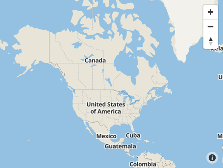

# Tileserver

[docker-compose](https://docs.docker.com/compose/) setup for [tileserver-gl](https://github.com/klokantech/tileserver-gl).

## Screenshot



## Install

Install [docker](https://docs.docker.com/install/linux/docker-ce/ubuntu/) and [docker-compose](https://docs.docker.com/compose/).

```bash
sudo apt-get install docker-compose
```

## Build & Run

```bash
make up
```

## Obtain Datasets:

By default, it will download the demo dataset `zurich_switzerland.mbtiles` to `./data`.

You may want to add more [datasets](https://openmaptiles.com/downloads/planet/):

There are some TOS items to agree to, but they're all basically free.

* [Africa](https://openmaptiles.com/downloads/africa/)
* [Asia](https://openmaptiles.com/downloads/asia/)
* [Australia & Oceania](https://openmaptiles.com/downloads/australia-oceania/)
* [Central America](https://openmaptiles.com/downloads/central-america/)
* [Europe](https://openmaptiles.com/downloads/europe/)
* [North America](https://openmaptiles.com/downloads/north-america/)
* [South America](https://openmaptiles.com/downloads/south-america/)

## Usage 

I can recommend using [react-leaflet](https://github.com/PaulLeCam/react-leaflet) to load up these tiles.

* Admin panel: http://localhost:8085/
* Basic style pattern: 
  * Example: http://localhost:8085/styles/klokantech-basic/13/4292/2868.png
  * Leaflet Tilelayer url: http://localhost:8085/styles/klokantech-basic/{z}/{x}/{y}.png
* OSM Bright style pattern: 
  * Example: http://localhost:8085/styles/osm-bright/13/4292/2868.png
  * Leaflet Tilelayer url: http://localhost:8085/styles/osm-bright/{z}/{x}/{y}.png

